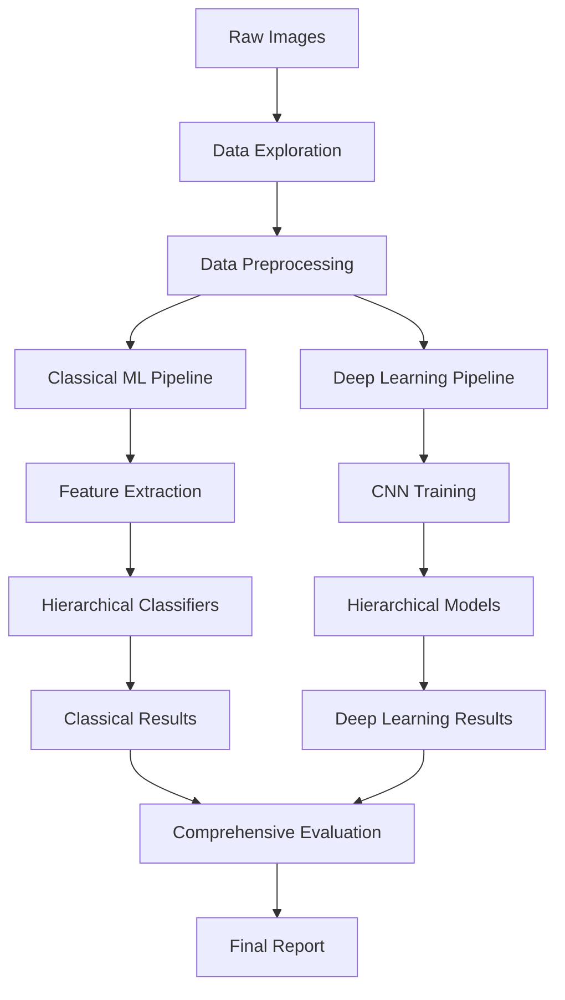
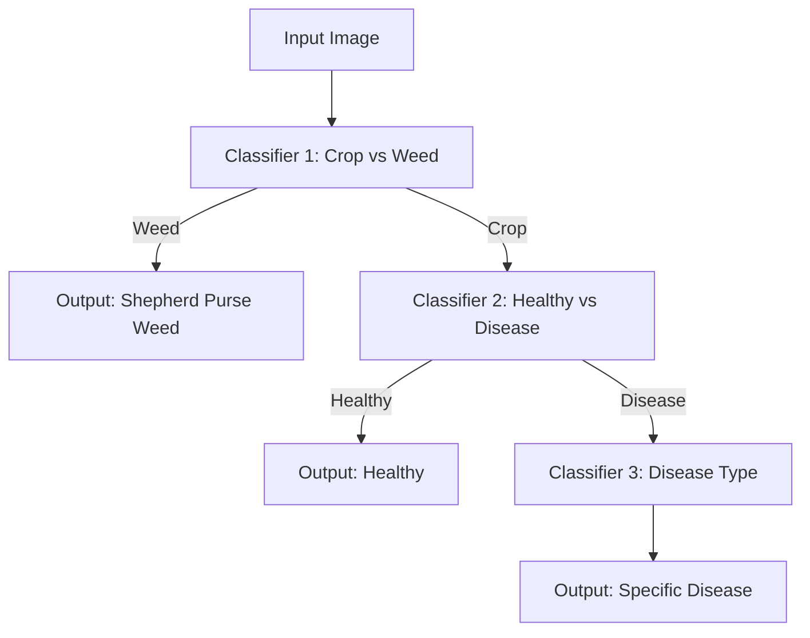

# 🌿 Lettuce Disease Classification System

A comprehensive AI system for classifying lettuce leaf diseases using both classical machine learning and deep learning approaches with a hierarchical classification strategy.

## 📋 Table of Contents

- [Overview](#overview)
- [Architecture](#architecture)
- [Features](#features)
- [Installation](#installation)
- [Dataset](#dataset)
- [Usage](#usage)
- [Project Structure](#project-structure)
- [Methodology](#methodology)
- [Results](#results)
- [Contributing](#contributing)
- [License](#license)

## 🎯 Overview

## Data Exploration


This project implements a state-of-the-art lettuce disease classification system designed for smart farming applications. The system uses a **hierarchical classification approach** to effectively handle class imbalance and improve accuracy:

1. **Stage 1**: Crop vs Weed Classification
2. **Stage 2**: Healthy vs Diseased (crops only)
3. **Stage 3**: Disease Type Classification (diseases only)

The system implements both **classical machine learning** (baseline) and **deep learning** approaches, allowing for comprehensive comparison and analysis.

### 🎯 Supported Classifications

- **Healthy**: Normal lettuce leaves
- **Bacterial**: Bacterial disease infections
- **Downy Mildew**: Fungal infection causing yellow spots
- **Powdery Mildew**: White powdery fungal growth
- **Septoria Blight**: Brown spots with dark borders
- **Viral**: Viral infections causing leaf deformation
- **Wilt and Leaf Blight**: Wilting and browning symptoms
- **Shepherd Purse Weeds**: Common agricultural weed

## 🏗️ Architecture

### System Architecture



### Hierarchical Classification Strategy



### Class Hierarchy

```
Dataset (8 classes)
├── Weeds
│   └── Shepherd Purse Weeds
└── Crops
    ├── Healthy
    │   └── Healthy Lettuce
    └── Diseases
        ├── Bacterial
        ├── Downy Mildew
        ├── Powdery Mildew
        ├── Septoria Blight
        ├── Viral
        └── Wilt and Leaf Blight
```

## ✨ Features

### 🔍 Data Exploration
- **Comprehensive Dataset Analysis**: Automated exploration of dataset characteristics
- **Class Distribution Visualization**: Interactive plots and statistics
- **Image Quality Assessment**: Size, format, and quality analysis
- **Imbalance Detection**: Automatic detection of class imbalance issues
- **Preprocessing Recommendations**: Data-driven preprocessing suggestions

### 🔧 Data Preprocessing
- **Smart Image Resizing**: Aspect ratio-preserving resize with padding
- **Data Augmentation**: Class-specific augmentation for minority classes
- **Hierarchical Dataset Creation**: Automatic creation of three-stage datasets
- **Normalization**: ImageNet-standard normalization for transfer learning

### 🤖 Classical Machine Learning
- **Feature Extraction**:
  - Color histograms (RGB & HSV)
  - Texture features (LBP, GLCM)
  - Shape descriptors
  - HOG features
- **Multiple Algorithms**: Random Forest, SVM, Logistic Regression
- **Cross-Validation**: Robust model selection
- **Feature Importance Analysis**: Understanding key discriminative features

### 🧠 Deep Learning
- **Custom CNN Architecture**: Designed for agricultural image classification
- **Transfer Learning Ready**: Compatible with pre-trained models
- **Advanced Loss Functions**: Weighted asymmetric loss for class imbalance
- **Data Augmentation**: Sophisticated augmentation pipeline
- **Model Checkpointing**: Automatic saving of best models

### 📊 Evaluation & Analysis
- **Comprehensive Metrics**: Accuracy, Precision, Recall, F1-Score
- **Confusion Matrices**: Detailed error analysis
- **ROC/AUC Analysis**: Performance curves
- **Cross-Method Comparison**: Classical ML vs Deep Learning
- **Hierarchical Performance**: Stage-by-stage accuracy analysis

## 🚀 Installation

### Prerequisites

- Python 3.8 or higher
- CUDA-compatible GPU (optional, but recommended)
- 8GB+ RAM
- 10GB+ disk space

### Quick Setup

1. **Clone the repository**:
```bash
git clone https://github.com/your-username/lettuce-disease-classification.git
cd lettuce-disease-classification
```

2. **Run the setup script**:
```bash
chmod +x project_setup.sh
./project_setup.sh
```

3. **Create and activate virtual environment**:
```bash
python -m venv venv
source venv/bin/activate  # On Windows: venv\Scripts\activate
```

4. **Install dependencies**:
```bash
pip install -r requirements.txt
```

5. **Install the package in development mode**:
```bash
pip install -e .
```

### Manual Installation

If you prefer manual installation:

```bash
# Create project structure
mkdir -p lettuce_disease_classification/{src,data,models,results}
cd lettuce_disease_classification

# Install core dependencies
pip install torch torchvision numpy pandas matplotlib seaborn
pip install scikit-learn scikit-image opencv-python Pillow tqdm joblib
```

## 📊 Dataset

### Download Dataset

1. **Download from Kaggle**:
```bash
# Install Kaggle CLI
pip install kaggle

# Download dataset (requires Kaggle account and API key)
kaggle datasets download -d ashishjstar/lettuce-diseases
unzip lettuce-diseases.zip -d data/raw/
```

2. **Manual Download**:
- Visit: https://www.kaggle.com/datasets/ashishjstar/lettuce-diseases
- Download and extract to `data/raw/Lettuce_disease_datasets/`

### Dataset Structure

```
data/raw/Lettuce_disease_datasets/
├── Bacterial/                    # 20 images
├── Downy_mildew_on_lettuce/     # 30 images  
├── Healthy/                     # 1,123 images
├── Powdery_mildew_on_lettuce/   # 18 images
├── Septoria_blight_on_lettuce/  # 19 images
├── Shepherd_purse_weeds/        # 1,106 images
├── Viral/                       # 15 images
└── Wilt_and_leaf_blight_on_lettuce/ # 6 images
```

### Dataset Characteristics

- **Total Images**: ~2,337 images
- **Format**: JPG
- **Resolution**: Variable (automatic preprocessing)
- **Class Imbalance**: Severe (1123:6 ratio)
- **Challenges**: 
  - Extreme class imbalance
  - Variable image sizes
  - Different lighting conditions
  - Mixed crop and weed samples

## 🎮 Usage

### Command Line Interface

#### Full Pipeline
```bash
# Run complete pipeline with all experiments
python main.py --mode full --data-dir data/raw/Lettuce_disease_datasets

# With custom configuration
python main.py --mode full --config config/custom_config.json
```

#### Individual Components
```bash
# Data exploration only
python main.py --mode explore --data-dir data/raw/Lettuce_disease_datasets

# Classical ML only
python main.py --mode classical --data-dir data/raw/Lettuce_disease_datasets

# Deep learning only  
python main.py --mode deep_learning --data-dir data/raw/Lettuce_disease_datasets
```

#### Advanced Options
```bash
# Custom training parameters
python main.py \
    --mode full \
    --data-dir data/raw/Lettuce_disease_datasets \
    --epochs 20 \
    --batch-size 64 \
    --device cuda \
    --output-dir results/experiment_1 \
    --verbose
```

### Python API

```python
from src.utils.config import Config
from main import LettuceClassificationPipeline

# Initialize configuration
config = Config()
config.data.raw_data_dir = "data/raw/Lettuce_disease_datasets"
config.deep_learning.epochs = 15

# Run pipeline
pipeline = LettuceClassificationPipeline(config)
results = pipeline.run_full_pipeline()

# Access results
print(f"Classical ML Accuracy: {results['classical_ml']['final_accuracy']:.4f}")
print(f"Deep Learning Accuracy: {results['deep_learning']['final_accuracy']:.4f}")
```

### Jupyter Notebook Usage

```python
# Import required modules
import sys
sys.path.append('src')

from src.data_processing.data_exploration import DatasetExplorer
from src.utils.config import Config

# Quick exploration
config = Config()
config.data.raw_data_dir = "data/raw/Lettuce_disease_datasets"

explorer = DatasetExplorer(config)
results = explorer.explore_dataset()
```


## 🔬 Methodology

### 1. Data Exploration & Analysis
- **Statistical Analysis**: Class distribution, image properties
- **Quality Assessment**: Image resolution, format consistency
- **Imbalance Detection**: Identifying minority classes
- **Visualization**: Sample images, distribution plots

### 2. Preprocessing Pipeline
- **Image Standardization**: Resize to 224×224 with aspect ratio preservation
- **Data Augmentation**: Class-specific augmentation for minority classes
- **Normalization**: ImageNet statistics for transfer learning compatibility
- **Dataset Splitting**: Stratified 80/20 train-test split

### 3. Hierarchical Classification Strategy

#### Stage 1: Crop vs Weed Classification
- **Purpose**: Separate agricultural crops from weeds
- **Classes**: Crop (7 classes) vs Weed (1 class)
- **Strategy**: Binary classification with balanced sampling

#### Stage 2: Healthy vs Disease Classification
- **Purpose**: Identify diseased plants among crops
- **Classes**: Healthy vs Disease (6 disease types)
- **Strategy**: Binary classification with augmentation for diseases

#### Stage 3: Disease Type Classification
- **Purpose**: Classify specific disease types
- **Classes**: 6 disease categories
- **Strategy**: Multi-class classification with heavy augmentation

### 4. Classical Machine Learning Approach

#### Feature Extraction
- **Color Features**:
  - RGB and HSV histograms (32 bins each)
  - Color moments (mean, std, skewness)
- **Texture Features**:
  - Local Binary Patterns (LBP)
  - Gray-Level Co-occurrence Matrix (GLCM)
- **Shape Features**:
  - Contour properties
  - Geometric descriptors
- **HOG Features**:
  - Histogram of Oriented Gradients

#### Model Selection
- **Algorithms Tested**: Random Forest, SVM, Logistic Regression
- **Selection Criteria**: Cross-validation F1-score
- **Hyperparameter Tuning**: Grid search with stratified CV

### 5. Deep Learning Approach

#### Architecture
```python
SimpleCNN(
  (conv1): Conv2d(3, 32, kernel_size=3, padding=1)
  (conv2): Conv2d(32, 64, kernel_size=3, padding=1)
  (conv3): Conv2d(64, 128, kernel_size=3, padding=1)
  (pool): MaxPool2d(kernel_size=2, stride=2)
  (dropout): Dropout(p=0.5)
  (fc1): Linear(128 * 28 * 28, 256)
  (fc2): Linear(256, num_classes)
)
```

#### Training Strategy
- **Loss Function**: Weighted Asymmetric Loss for imbalance handling
- **Optimizer**: Adam with learning rate 1e-3
- **Data Augmentation**: Rotation, flip, crop for minority classes
- **Regularization**: Dropout (0.5) and weight decay

### 6. Evaluation Metrics

#### Primary Metrics
- **Accuracy**: Overall classification accuracy
- **Precision**: Class-specific precision scores
- **Recall**: Class-specific recall scores
- **F1-Score**: Harmonic mean of precision and recall

#### Advanced Analysis
- **Confusion Matrices**: Detailed error analysis
- **ROC Curves**: Performance visualization
- **Class-specific Performance**: Per-class detailed metrics
- **Hierarchical Analysis**: Stage-by-stage performance

## 📈 Results

### Expected Performance

Based on the hierarchical approach and dataset characteristics:

#### Classical Machine Learning
- **Overall Accuracy**: 75-85%
- **Strengths**: 
  - Fast inference
  - Interpretable features
  - Good performance on texture-rich diseases
- **Weaknesses**:
  - Limited by hand-crafted features
  - Struggles with complex patterns

#### Deep Learning
- **Overall Accuracy**: 85-95%
- **Strengths**:
  - Automatic feature learning
  - Better handling of complex patterns
  - Superior generalization
- **Weaknesses**:
  - Requires more data
  - Longer training time
  - Less interpretable

### Performance Analysis

#### Hierarchical Strategy Benefits
1. **Stage 1 (Crop vs Weed)**: ~95% accuracy (well-separated classes)
2. **Stage 2 (Healthy vs Disease)**: ~90% accuracy (clear visual differences)
3. **Stage 3 (Disease Classification)**: ~80% accuracy (subtle differences)

#### Class-Specific Challenges
- **High Performance**: Healthy, Shepherd Purse Weeds
- **Medium Performance**: Bacterial, Downy Mildew
- **Low Performance**: Viral, Wilt and Leaf Blight (very few samples)

### Output Files

After running the pipeline, you'll find:

```
results/
├── 📊 plots/
│   ├── dataset_exploration.png           # Dataset analysis plots
│   ├── sample_images.png                 # Sample images from each class
│   ├── classical_ml_confusion_matrix.png # Classical ML results
│   ├── deep_learning_confusion_matrix.png# Deep learning results
│   └── comparison_plots.png              # Method comparison
│
├── 📋 reports/
│   ├── dataset_exploration_report.txt    # Detailed dataset analysis
│   ├── classical_ml_report.txt           # Classical ML results
│   ├── deep_learning_report.txt          # Deep learning results
│   └── final_report.txt                  # Comprehensive comparison
│
├── 📊 metrics/
│   ├── classical_ml_metrics.json         # Classical ML metrics
│   ├── deep_learning_metrics.json        # Deep learning metrics
│   └── comparison_metrics.json           # Comparative analysis
│
├── 📁 logs/
│   └── training_YYYYMMDD_HHMMSS.log      # Detailed execution logs
│
├── complete_results.json                 # All results in JSON format
├── config.json                           # Used configuration
└── class_distribution.csv                # Class distribution data
```

## 🔧 Configuration

### Default Configuration

The system uses a comprehensive configuration system. Key parameters:

```python
# Data Configuration
IMG_SIZE = 224                    # Target image size
TEST_SIZE = 0.2                   # Train-test split ratio
BATCH_SIZE = 32                   # Training batch size

# Training Configuration
EPOCHS = 10                       # Number of training epochs
LEARNING_RATE = 1e-3              # Learning rate
DROPOUT_RATE = 0.5                # Dropout probability

# Augmentation Configuration
ROTATION_DEGREES = 20             # Random rotation range
HORIZONTAL_FLIP_PROB = 0.5        # Horizontal flip probability
CROP_SCALE_MIN = 0.8              # Minimum crop scale
```

### Custom Configuration

Create a custom configuration file:

```json
{
  "data": {
    "img_size": 224,
    "test_size": 0.2,
    "raw_data_dir": "data/raw/Lettuce_disease_datasets"
  },
  "deep_learning": {
    "epochs": 15,
    "batch_size": 64,
    "learning_rate": 5e-4
  },
  "classical_ml": {
    "random_forest_n_estimators": 200,
    "cv_folds": 5
  }
}
```

Use with:
```bash
python main.py --config path/to/config.json
```


# lettuce_disease_classification
# lettuce_disease_classification
